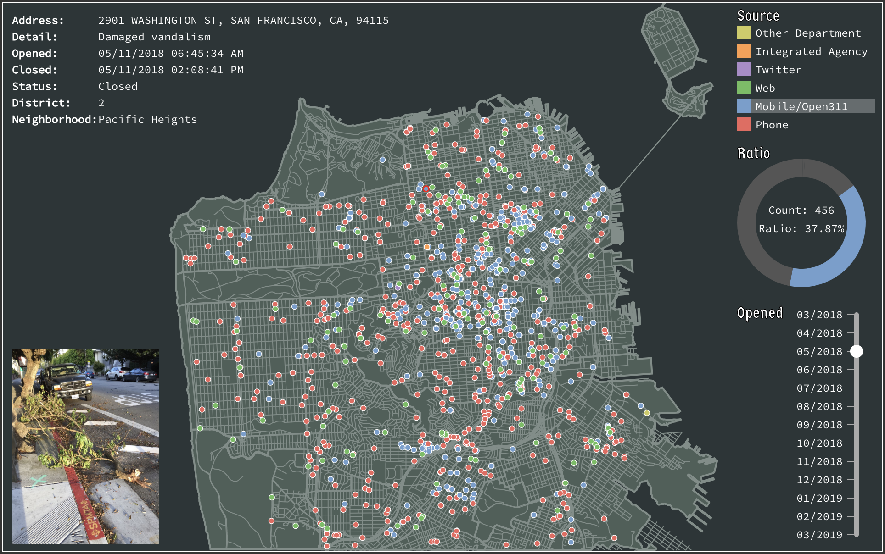

# San Francisco Tree Maintenance March 2018 to March 2019

## Introduction

The dataset I used in this project was 311 Cases sourced from data.sfgov.org. This project focused on visualizing tree maintenance data happened between 03/01/2018 and 03/01/2019, especially with geospatial data, in order to get a better understanding about the stories underneath. I used Python3 and Tableau for creating my prototype, and I used D3.js version 5 for implementing the visualization. The font styles used in this website are powered by Google Fonts.

## Screenshot

## Author

* **Brian Sung** - *Graduate student in department of Computer Science at University of San Francisco* - \[[LinkedIn](https://www.linkedin.com/in/ohbriansung/)\] \[[GitHub](https://github.com/ohbriansung)\]

## References
* \[0\] [Jekyll](https://help.github.com/articles/setting-up-your-github-pages-site-locally-with-jekyll/)
* \[1\] [Bulma.io](https://bulma.io/)
* \[2\] [FontAwesome](https://fontawesome.com/)
* \[3\] [Google Fonts](https://fonts.google.com/)
* \[4\] [D3.js v5](https://d3js.org)
* \[5\] [311 Cases by data.sfgov.org](https://data.sfgov.org/City-Infrastructure/311-Cases/vw6y-z8j6)
* \[6\] [SF Arrests Map by Sophie Engle](https://bl.ocks.org/sjengle/2f6d4832397e3cdd78d735774cb5a4f2)
* \[7\] [Circle Dragging I by Mike Bostock](https://bl.ocks.org/mbostock/22994cc97fefaeede0d861e6815a847e)
* \[8\] [SVG foreignObject Example by Mike Bostock](https://bl.ocks.org/mbostock/1424037)

## Acknowledgment

This is a repository setup for [CS 360/560 Data Visualization](/) for the Spring 2019 term at the [University of San Francisco](https://www.usfca.edu/). This project is for academic usages.
